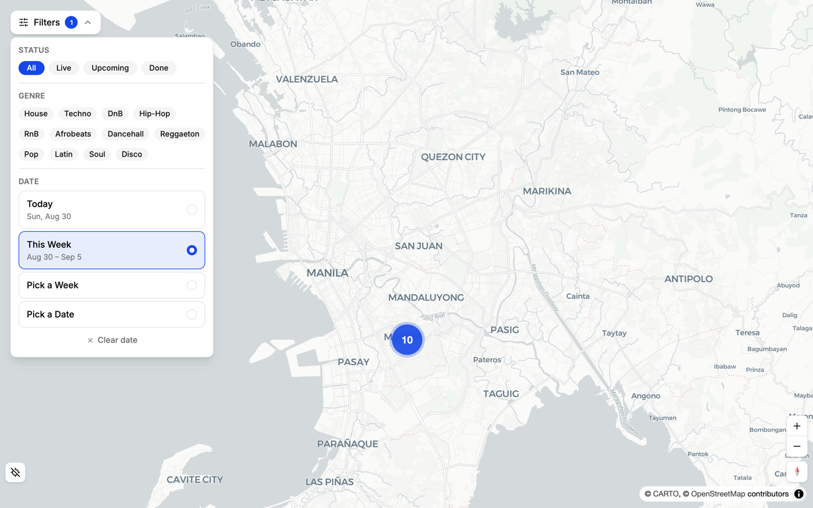
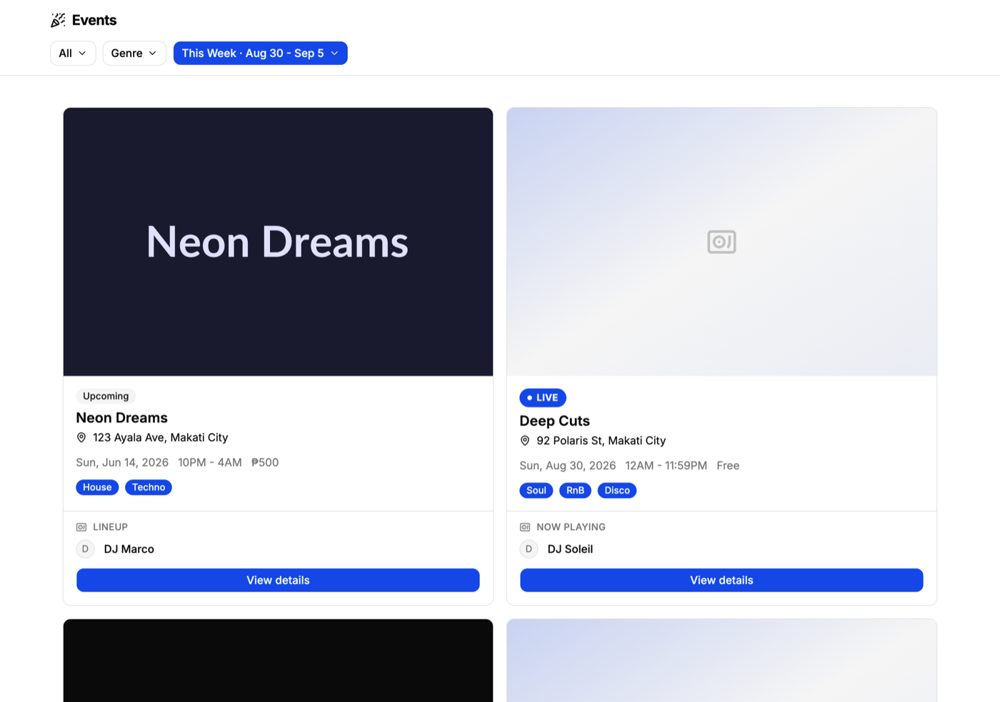
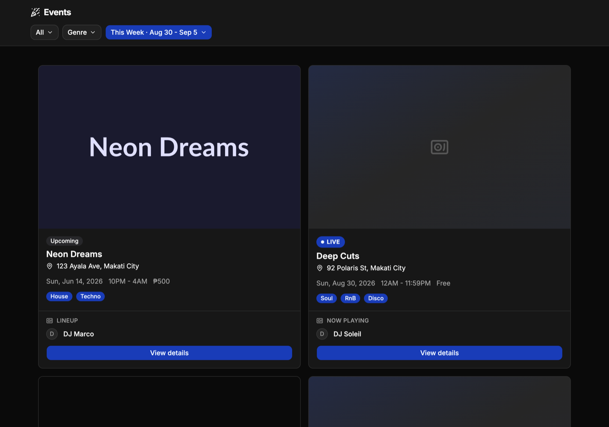
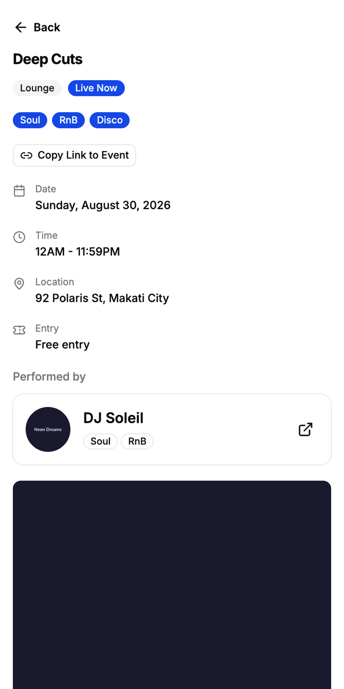

<div align="center">


# Function Finder

**Find out where the night is happening.**

An interactive map for discovering music events, venues, and DJs — and a publishing tool for the artists and hosts who run them.

[](https://nextjs.org)
[](https://react.dev)
[](https://www.typescriptlang.org)
[](https://tailwindcss.com)
[](https://maplibre.org)
[](https://supabase.com)
[](https://storybook.js.org)

**[Live app →](https://www.function-finder.app)** · **[Architecture deep-dive →](docs/ARCHITECTURE.md)**

</div>

---

<div align="center">
  
  <p><em>Nearby events collapse into clusters that split apart as you zoom in.</em></p>
</div>

<table>
<tr>
<td width="50%"></td>
<td width="50%"></td>
</tr>
<tr>
<td align="center"><em>Event discovery — light</em></td>
<td align="center"><em>…and dark, driven entirely by CSS variables</em></td>
</tr>
</table>

<div align="center">
  
  <p><em>Built mobile-first — event detail at 430px.</em></p>
</div>

> Screenshots are rendered from the Storybook fixtures in `stories/`, so they show representative data rather than whatever happens to be scheduled this week.

---

## Table of contents

- [What it does](#what-it-does)
- [Engineering highlights](#engineering-highlights)
- [Tech stack](#tech-stack)
- [Quick start](#quick-start)
- [Environment variables](#environment-variables)
- [How it fits together](#how-it-fits-together)
- [Project structure](#project-structure)
- [Routes](#routes)
- [State management](#state-management)
- [The map system](#the-map-system)
- [Styling and design system](#styling-and-design-system)
- [Storybook](#storybook)
- [Contributing](#contributing)
- [Roadmap and good first issues](#roadmap-and-good-first-issues)
- [Known gaps](#known-gaps)
- [License](#license)

---

## What it does

Three roles share one app (`ROLES` in `lib/constants.ts`):

| Role         | What they get                                                                          |
| ------------ | -------------------------------------------------------------------------------------- |
| `event-goer` | Browse the map and event list, filter by genre/date/status, view event and DJ profiles |
| `dj`         | The above, plus an Events Manager and the ability to create and edit events            |
| `host`       | The same tooling, scoped to venue-hosted events                                        |

Core flows:

1. **Discover** — the map plots events as pins; nearby ones cluster and separate as you zoom. `/events` shows the same filtered set as cards.
2. **Filter** — genre, status (`live` / `upcoming` / `done`), and a date range, held in one shared store so the map and the list never disagree.
3. **Onboard** — a 4-step flow (role → profile → genres → summary) after signup.
4. **Publish** — DJs and hosts create events with image galleries, a map location picker with address autocomplete, and an ordered performer lineup.

---

## Engineering highlights

**Marker clustering without giving up the UI** — [`components/map/clusters/`](components/map/clusters/)
MapLibre ships native GeoJSON clustering, but it renders through the GL pipeline as circles, which can't host a hover flyer card or a pulsing "live" badge. Clustering instead runs in JS via `supercluster`, so cluster bubbles _and_ individual pins stay real DOM markers and keep their full design. Because `move` fires every animation frame, the hook keys on a rounded bbox/zoom string and bails when nothing meaningful changed.

**Anonymous-by-default auth** — [`components/providers/AuthProvider.tsx`](components/providers/AuthProvider.tsx)
Visitors with no session are signed in anonymously, so public pages still make authenticated API calls without forcing anyone to register. The subtlety that falls out: `user` is truthy for anonymous visitors, so gating real-account UI requires `isAuthenticated` (`!!user && !user.is_anonymous`).

**Two backends, one client** — [`lib/axios.ts`](lib/axios.ts), [`next.config.ts`](next.config.ts)
Supabase owns identity and file storage; a separate REST API owns domain data. The REST origin is never exposed to the browser — Next rewrites `/api/backend/*` to it — which also means zero CORS configuration. A request interceptor attaches the Supabase JWT from the in-memory session cache, so auth costs no round-trip.

**A declarative MapLibre wrapper** — [`components/ui/map.tsx`](components/ui/map.tsx)
~1,400 lines turning an imperative GL library into React components (`Map`, `MapMarker`, `MarkerPopup`, `MapRoute`, `MapControls`). Markers are portalled into MapLibre marker elements, so arbitrary React lives on the map. The map follows `next-themes` by watching the `<html>` class with a `MutationObserver` rather than taking a prop.

**Theming with zero `dark:` variants** — [`app/globals.css`](app/globals.css)
Every colour is a CSS variable. Components written against `bg-background` / `text-foreground` / `bg-card` adapt to dark mode for free — no duplicated colour values, no `dark:` classes.

**Design-system discipline** — the sidebar is the shadcn primitive with a custom off-canvas mobile path, `inert` on the closed panel so off-screen nav isn't tabbable, focus restoration, and scroll-lock — the accessibility a `Dialog` normally provides, re-implemented when the `Sheet` was removed.

---

## Tech stack

| Concern            | Choice                                                                      |
| ------------------ | --------------------------------------------------------------------------- |
| Framework          | Next.js 16 (App Router, Turbopack) + React 19                               |
| Language           | TypeScript, `strict: true`                                                  |
| Styling            | Tailwind CSS v4 (CSS-first, no `tailwind.config.ts`) + CSS-variable theming |
| Components         | shadcn/ui primitives in `components/ui/`                                    |
| Map                | MapLibre GL, Carto basemaps, `supercluster`                                 |
| Geocoding          | Google Places, proxied through Next route handlers                          |
| Auth & storage     | Supabase                                                                    |
| Domain data        | Separate REST API, proxied via rewrite                                      |
| HTTP               | axios + Supabase JWT interceptor                                            |
| State              | Zustand (feature-scoped), `next-themes`                                     |
| Component workshop | Storybook 10 (`@storybook/nextjs-vite`)                                     |
| Tooling            | ESLint 9 (flat config), Prettier 3                                          |

---

## Quick start

**Prerequisites:** Node 20+ and npm.

```bash
git clone https://github.com/jolonarvaez/function-finder-client.git
cd function-finder-client
npm install
```

Create `.env.local` in the project root:

```bash
NEXT_PUBLIC_SUPABASE_URL=https://<project>.supabase.co
NEXT_PUBLIC_SUPABASE_ANON_KEY=<anon-key>
NEXT_PUBLIC_API_URL=https://<your-backend>/api
NEXT_PUBLIC_GOOGLE_MAPS_API_KEY=<key>
```

Then:

```bash
npm run dev          # http://localhost:3000
npm run storybook    # http://localhost:6006
```

### No backend credentials? Use Storybook.

You don't need Supabase or the REST API to contribute to most of the UI. **Storybook runs entirely on fixtures** and is the fastest way in — every page and component has a story with representative mock data. A good deal of this project's UI work can be done in Storybook alone.

The app itself fails fast with a clear error if the Supabase variables are missing (`lib/supabase.ts`). The others degrade rather than crash: without `NEXT_PUBLIC_API_URL` no rewrite is registered and API calls 404; without the Maps key the geocode routes return HTTP 500.

---

## Environment variables

All four are read at build time. There's no committed `.env.example` — this table is the reference.

| Variable                          | Required           | Used by             | Purpose                                                |
| --------------------------------- | ------------------ | ------------------- | ------------------------------------------------------ |
| `NEXT_PUBLIC_SUPABASE_URL`        | Yes                | `lib/supabase.ts`   | Supabase project URL                                   |
| `NEXT_PUBLIC_SUPABASE_ANON_KEY`   | Yes                | `lib/supabase.ts`   | Supabase public anon key                               |
| `NEXT_PUBLIC_API_URL`             | Yes                | `next.config.ts`    | Backend origin; registers the `/api/backend/*` rewrite |
| `NEXT_PUBLIC_GOOGLE_MAPS_API_KEY` | For address search | `app/api/geocode/*` | Places autocomplete, place details, reverse geocoding  |

Basemap tiles come from **Carto** and need no key.

---

## How it fits together

```
                    ┌──────────────────────────────┐
   browser ────────▶│  Supabase                    │  auth, session, image storage
                    └──────────────────────────────┘

   browser ──▶ /api/backend/*  ──rewrite──▶  NEXT_PUBLIC_API_URL   events, users, lineups

   browser ──▶ /api/geocode/*  ──route handler──▶  Google Places   address search
```

`docs/ARCHITECTURE.md` has the full breakdown — routing, component layers, the data layer, and styling. Short version:

- **Route protection is per-page, not per-layout.** `AuthGuard` wraps each page under `/dj/*`, `/host/*`, and `/settings` individually. Adding a new authenticated page means adding the guard yourself — the `(app)` layout won't do it for you.
- **Route groups** split the two shells: `(app)` gets the sidebar + top nav + footer, `(legal)` is standalone.
- **Geocoding is proxied** through three route handlers so the Google key and CORS stay server-side.

---

## Project structure

```
app/
  (app)/                  authenticated shell — sidebar + top nav + footer
    page.tsx              map (home)
    map/  events/  venues/  profile/[id]/  settings/
    dj/     create-event, edit-event/[id], event-manager
    host/   create-event, edit-event/[id], event-manager
  (legal)/                standalone shell — privacy, terms
  api/geocode/            server-side Google Places proxy
  login/  signup/  onboarding/  auth/callback/
  layout.tsx              root: fonts, metadata, providers, Toaster
  robots.ts  sitemap.ts

components/
  ui/                     shadcn/ui primitives ONLY — never feature code
  auth/                   login, signup, AuthGuard, user store
  providers/              AuthProvider, ThemeProvider
  sidebar/                app shell: TopNav, AppSidebar, ProfileFooter
  map/                    MapView, markers, filters, geolocation
    clusters/             supercluster hook + cluster bubble marker
  event/                  list, detail, cards, gallery
    event-form/           create/edit form, location picker, performer selector
  dj/  onboarding/  profile/  settings/  venues/  legal/
  shared/                 cross-feature widgets (Logo, GenreSelector, Footer…)
  reusables/              generic helpers (PageContainer, CountrySelect…)

lib/
  axios.ts                API client + JWT interceptor
  supabase.ts             lazily-constructed Supabase client
  constants.ts            roles, genres, categories, countries, map defaults
  utils.ts                cn()
  services/               auth, events, users, storage, geocode

hooks/use-mobile.ts       768px breakpoint hook
stories/                  Storybook, mirroring components/
docs/                     ARCHITECTURE.md, screenshots
```

**Feature-folder rule:** related components get grouped into a feature folder; `components/ui/` is reserved exclusively for shadcn primitives.

---

## Routes

| Path                                      | Auth        | Description                     |
| ----------------------------------------- | ----------- | ------------------------------- |
| `/`, `/map`                               | Public      | Map view                        |
| `/events`                                 | Public      | Filterable event grid           |
| `/events/[id]`                            | Public      | Event detail                    |
| `/venues`                                 | Public      | Venue list                      |
| `/profile/[id]`                           | Public      | Public user profile             |
| `/settings`                               | **Guarded** | Account, profile, genres, theme |
| `/dj/event-manager`                       | **Guarded** | DJ's events                     |
| `/dj/create-event`, `/dj/edit-event/[id]` | **Guarded** | DJ event form                   |
| `/host/*` (same three)                    | **Guarded** | Host equivalents                |
| `/login`, `/signup`                       | Public      | Email + Google OAuth            |
| `/onboarding`                             | Post-signup | 4-step setup                    |
| `/auth/callback`                          | —           | OAuth redirect target           |
| `/privacy`, `/terms`                      | Public      | Legal                           |

---

## State management

Zustand stores live **beside the feature they belong to**, not in a central directory.

| Store                | Location                                        | Holds                                          |
| -------------------- | ----------------------------------------------- | ---------------------------------------------- |
| `useMapFilterStore`  | `components/map/use-map-filter-store.ts`        | Genres, query, status, date range              |
| `useUserStore`       | `components/auth/use-user-store.ts`             | Cached profile + loading flag                  |
| `useOnboardingStore` | `components/onboarding/use-onboarding-store.ts` | Step, role, display name, bio, country, genres |

Theme is `next-themes`, not Zustand.

`useMapFilterStore` is the one to know: the map and the events page read the same store, so changing a filter in one changes both. `setDateRange(type, ref)` derives `startDate`/`endDate` from a `"day" | "week" | "month"` type plus a reference date, so components express intent rather than raw dates.

---

## The map system

`components/ui/map.tsx` is a self-contained MapLibre wrapper exposing `Map`, `MapMarker`, `MarkerContent`, `MarkerPopup`, `MarkerTooltip`, `MarkerLabel`, `MapPopup`, `MapControls`, `MapRoute`, `MapClusterLayer`, and `useMap`.

### How clustering places bubbles

`supercluster` projects every event into normalised Mercator and precomputes a cluster tree for **every zoom level** up front — zooming just swaps which precomputed set renders, which is why it stays smooth.

Two events merge when they're within **60 screen pixels** of each other. Since zooming doubles the scale, the ground distance those 60px represent halves each step:

| Zoom | Events merge within |
| ---- | ------------------- |
| 11   | ~2.2 km             |
| 12   | ~1.1 km             |
| 13   | ~550 m              |
| 14   | ~280 m              |
| 16   | ~70 m (`maxZoom`)   |

A bubble sits at the **count-weighted average position** of the events inside it — so it generally sits where no single event actually is. Clicking one calls `getClusterExpansionZoom` and eases to exactly the zoom where that cluster breaks apart.

### Geolocation

`use-geolocation.ts` wraps `watchPosition` with a `granted | denied | prompt` status. The map silently snaps to the user's location once on load _only if permission was already granted before this visit_, without showing the marker or toggle. The explicit toggle animates and shows the marker; denial surfaces a dismissible banner.

---

## Styling and design system

**All colour comes from CSS variables in `app/globals.css`.** No hex values, no `rgb()`, no Tailwind colour utilities (`blue-500`, `indigo-600`) in components. Anything blue uses `bg-primary` / `text-primary` / `border-primary`.

That's what makes dark mode work: both palettes are variables, so components written against `bg-background`, `text-foreground`, `border-border`, `bg-card`, `bg-muted`, `text-muted-foreground` adapt automatically. **Don't** use Tailwind's `dark:` variant to re-specify a colour the theme already handles.

- **`cn()`** from `lib/utils.ts` for every conditional or merged class
- **CVA** for multi-variant components
- **`@/`** maps to the project root
- PascalCase functional components, props as `Readonly<{…}>` or a named `XxxProps`
- WCAG AA: semantic HTML, visible focus states, `aria-label` on icon-only buttons, 44×44px touch targets, `prefers-reduced-motion` respected

Adding a shadcn component: `npx shadcn@latest add <component>`

---

## Storybook

Stories mirror the component tree: component stories in `stories/<feature>/`, page stories in `stories/Pages/<feature>/`, titles using `/` for hierarchy (`Pages/Event/EventsView`).

- **Component stories** wrap the decorator in `<div className="mx-auto max-w-200 bg-background p-6">` (≤800px).
- **Page stories** use `layout: "fullscreen"` and wrap in `<div className="mx-auto w-full max-w-107.5 overflow-hidden bg-background">` to simulate a 430px mobile viewport. Don't force `dark` — let the theme stay fluid.

For pages that fetch their own data, export a display-only sub-component taking data as props (e.g. `EventsContent` beside `EventsView`) and write the story against that. `.storybook/main.ts` forwards `NEXT_PUBLIC_*` vars into the Vite build.

---

## Contributing

Contributions are welcome. Bug reports, design fixes, and accessibility improvements are all useful.

### Workflow

1. **Open an issue first** for anything non-trivial, so we can agree on the approach before you spend time on it.
2. Fork, then branch from `main`. Name it `feat/…`, `fix/…`, `docs/…`, `refactor/…`, or `chore/…`.
3. Make the change, keeping it focused — one concern per PR.
4. Run the checks below until clean.
5. Open a PR describing **what changed and why**, with before/after screenshots for anything visual.

### Before every commit

```bash
npm run format   # Prettier, writes in place
npm run lint     # ESLint
npx tsc --noEmit # type check
```

All three must pass. Note that `npm run lint` also walks the committed `storybook-static/` bundle and reports thousands of vendor warnings — for a clean signal on your own work, scope it:

```bash
npx eslint components app lib hooks stories
```

### PR checklist

- [ ] `format`, `lint`, and `tsc --noEmit` all clean
- [ ] New component or page has a Storybook story
- [ ] No hardcoded colours — every colour maps to a `globals.css` variable
- [ ] Verified in **both** light and dark mode
- [ ] Verified at mobile (430px) **and** desktop widths
- [ ] Interactive elements have hover, focus-visible, and active states
- [ ] Icon-only buttons have an `aria-label`
- [ ] New authenticated page is wrapped in `AuthGuard`

### Recipes

**Add a component**

1. Put it in its feature folder under `components/` (not `components/ui/` — that's shadcn-only).
2. Type props as `Readonly<{…}>` or a named `XxxProps`.
3. Use `cn()` for classes; CVA if it has variants.
4. Add `stories/<feature>/MyComponent.stories.tsx` with the ≤800px decorator.

**Add a page**

1. Create `app/(app)/my-page/page.tsx`.
2. If it needs a real account, wrap it in `AuthGuard`.
3. If it fetches its own data, split out a display-only sub-component that takes data as props.
4. Add `stories/Pages/…` against that sub-component, using the fullscreen + 430px decorator.

**Add a nav item** — `components/sidebar/AppSidebar.tsx`. Every `SidebarMenuButton` needs a `tooltip`, since it's the only label visible when the sidebar is collapsed to icons.

### Commit style

Short imperative subject lines. Conventional Commits (`feat:`, `fix:`, `docs:`) are welcome but not enforced.

---

## Roadmap and good first issues

Genuinely useful, reasonably self-contained work:

| Idea                                         | Why it matters                                                                           |
| -------------------------------------------- | ---------------------------------------------------------------------------------------- |
| **Add a test suite**                         | There's no test runner at all. Vitest + Testing Library, or merging the `cypress` branch |
| **Add `.env.example`**                       | New contributors currently have to read this README to know what to set                  |
| **Remove `storybook-static/` from git**      | Would cut thousands of phantom lint warnings                                             |
| **Rename `NEXT_PUBLIC_GOOGLE_MAPS_API_KEY`** | It's only read server-side; the prefix wrongly implies it's browser-safe                 |
| **Reconcile `CLAUDE.md`**                    | It still documents Stadia Maps, which the codebase no longer uses                        |
| **Cluster hover previews**                   | Show which events a bubble contains before committing to a zoom                          |
| **Empty and error states**                   | Several views only really handle the happy path                                          |
| **i18n**                                     | Copy is hardcoded English; the settings page already has a language row stubbed out      |

---

## Known gaps

Stated plainly, so nobody is surprised:

- **No automated tests.** No unit, integration, or E2E tests run in CI — CI is `lint` + `build` only. A Cypress setup exists on the unmerged `cypress` branch.
- **Stadia Maps references are stale.** `CLAUDE.md` documents `NEXT_PUBLIC_STADIA_API_KEY` and a `StadiaStyleId` type in `lib/maps/types.ts`; neither exists. The map uses keyless Carto basemaps. CI still passes the unused secret.
- **`storybook-static/` is committed**, so repo-wide lint output is noisy.
- **A Supabase storage hostname is hardcoded** in `next.config.ts` (`images.remotePatterns`) — pointing at a different project needs that updated too.
- **`MapClusterLayer` is dead code**, superseded by `components/map/clusters/`.

---

## License

No licence file is currently present, which means the work is **all rights reserved** by default and others have no legal right to use, modify, or redistribute it.

If you want outside contributions, add a `LICENSE` — MIT is the usual choice for a project like this.

---

<div align="center">
<sub>Built by <a href="https://github.com/jolonarvaez">@jolonarvaez</a> · <a href="https://www.function-finder.app">function-finder.app</a></sub>
</div>
